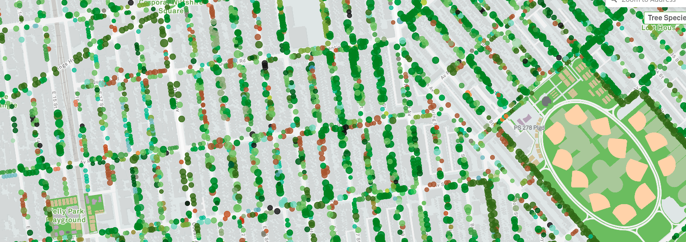

Il y a quelques jours, [@orovellotti](https://twitter.com/orovellotti) m’a 
transmis [un article][14] de Medium qui expliquait comment la startup française **[nam.R](https://namr.com)**
avait construit une base de données référentielle homogène et normalisée des 
plus de deux millions d’arbres urbains référencés en France par différents 
services publics. J’ai adoré le projet, et il tombe à pic pour montrer comment 
créer une carte de tuiles vectorielles avec les données produites par nam.R.



## Créer le dossier du projet

=== "Linux / OSX"
    ```bash
    mkdir arbres && cd arbres
    ```

=== "Windows (PS)"
    ```Powershell
    mkdir arbres; cd arbres
    ```

## Télécharger les données

Le résultat du travail de Nam.R se trouve [ici][7]. On peut télécharger le fichier au 
format **geojson** ou **CSV**. On choisit la version csv car elle occupe bien moins 
d’espace.

=== "Linux / OSX"
    ```bash
    curl -L https://www.data.gouv.fr/fr/datasets/r/aaaddd02-206f-4d60-a04c-9a201297a3da > arbres.csv
    ```

=== "Windows (PS)"
    ```Powershell
    Invoke-WebRequest https://www.data.gouv.fr/fr/datasets/r/aaaddd02-206f-4d60-a04c-9a201297a3da -OutFile arbres.csv
    ```

## Tippecanoe : un chef d'oeuvre d'ingénierie

[Tippecanoe][3] est l'outil qui permet de créer des tuiles vectorielles depuis de grandes (ou petites) collections de GeoJSON, Geobuf, or CSV...

L'objectif de Tippecanoe est de permettre de visualiser des données indépendamment de l'échelle à laquelle elles sont représentées, de sorte que l'on puisse apprécier la densité et la texture des données à n'importe quel niveau, qu'il s'agisse du monde entier (z=0) ou d'un seul immeuble (z=22), au lieu d'une vue simplifiée qui élimine des caractéristiques supposément sans importance, les regroupe ou les assemble. 

Quelques exemples:

* Si l'on utilise toutes les données d'OpenStreetMap et que l'on fait un zoom extérieur, le rendu devrait ressembler à "toutes les rues" et non à quelque chose qui ressemblerait à un atlas des routes nationales.

* Si l'on utilise comme données d'entrée toutes les bases d'immeubles de Los Angeles et que l'on fait un zoom extérieur suffisamment éloigné pour ne plus arriver à distinguer la plupart des immeubles individuels, on devrait tout de même encore pouvoir voir l'extension et la variété de chaque quartier, et pas uniquement les immeubles les plus imposants du centre.

La qualité des résultats obtenus avec Tippecanoe est ainsi bien supérieure à celle d'autres alternatives qui utilisent des algorithmes de simplification plus conventionnels. Et aussi surprenant que cela puisse paraitre, Tippecanoe est en plus plus rapide pour traiter les données. 

## Installation de Tippecanoe

=== "Linux"
    ```sh
    git clone https://github.com/mapbox/tippecanoe.git
    cd tippecanoe
    make -j
    sudo make install
    ```

=== "OSX"
    ```sh
    brew install tippecanoe
    ```

=== "Windows (WSL)"
    Tippecanoe s’éxécute uniquement dans des environnements unix type MacOS et 
    Linux, vous aurez donc un problème si vous êtes sur Windows. Mais WSL offre 
    une solution à ce problème.

    **Etapes**

    1. [Installer le sous-système de Windows pour Linux (WLS) - Ubuntu][2]
    2. Ouvrir Ubuntu Bash une fois installé
    3. Installer les dépendances pour pouvoir compiler Tippecanoe
    ```sh
    sudo apt-get install software-properties-common
    sudo apt-add-repository ppa:git-core/ppa
    sudo apt-get update
    sudo apt install git unzip wget build-essential libsqlite3-dev zlib1g-dev
    ```
    4. Compiler et installer Tippecanoe
    ```sh
    git clone https://github.com/mapbox/tippecanoe.git
    cd tippecanoe
    make -j
    sudo make install
    ```
    5. Vérifier l’installation
    ```sh
    tippecanoe --version
    ```

## Créer les tuiles

```bash
tippecanoe --output-to-directory tiles \
           --force \
           --exclude-all \
           --maximum-zoom=g \
           --drop-densest-as-needed \
           --extend-zooms-if-still-dropping \
           arbres.csv
```
    
* **-e directory or --output-to-directory=directory:** Ecrit les tuiles dans un dossier spécifique plutôt que dans un fichier mbtiles.
* **-f or --force:** Elimine le dossier de tuiles s’il existait déjà et évite d’afficher une erreur.
* **-X or --exclude-all:** Exclut tous les attributs de chaque élément et codifie seulement les géométries.
* **-zg:** Choisit automatiquement le zoom qui devrait suffire pour distinguer clairement les caractéristiques et détails de chaque élément.
* **--drop-densest-as-needed:** Si une tuile est trop grande, essaie de la réduire à moins de 500K pour augmenter l’espace minimum entre les éléments. L’espacement découvert s’applique à tout le niveau de zoom.
* **--extend-zooms-if-still-dropping:** Si les tuiles sont trop grandes même dans les niveaux élevés de zoom, continue d’ajouter des niveaux de zoom jusqu’à parvenir à un niveau qui puisse représenter toutes les caractéristiques.

## Montrer les tuiles en local

Très bien, nous avons maintenant notre dossier de tuiles avec la structure suivante :  
`/tiles/z/x/y.pbf` mais, comment peut-on voir le résultat? C’est très simple, on 
créé d’abord un fichier `index.html` qui contiendra une page [Mapbox GL JS][12] qui à 
son tour contiendra la définition de deux sources d’entrée, [OSM][13] et notre serveur 
web statique local (je développe dans le point suivant).

```html
<!DOCTYPE html>
<html lang="en">

<head>
  <meta charset="UTF-8">
  <meta name="viewport" content="width=device-width, initial-scale=1.0">
  <script src="https://api.mapbox.com/mapbox-gl-js/v1.9.1/mapbox-gl.js"></script>
  <link href="https://api.mapbox.com/mapbox-gl-js/v1.9.1/mapbox-gl.css" rel="stylesheet" />
  <title>Comment créer une carte web statique avec plus de 2 millions d'arbres?</title>
  <style>
    body {
      margin: 0;
      padding: 0;
    }

    #map {
      position: absolute;
      top: 0;
      bottom: 0;
      width: 100%;
    }
  </style>
</head>

<body>
  <div id="map"></div>
  <script>
    var tilesOSM = [
      "http://a.tile.openstreetmap.fr/osmfr/{z}/{x}/{y}.png",
      "http://b.tile.openstreetmap.fr/osmfr/{z}/{x}/{y}.png",
      "http://c.tile.openstreetmap.fr/osmfr/{z}/{x}/{y}.png"
    ]
    var tilesArbres = [
      `${window.location.origin}/tiles/{z}/{x}/{y}.pbf`
    ]
    var map = new mapboxgl.Map({
      center: [
        2.548828,
        46.739861
      ],
      zoom: 5,
      container: 'map',
      style: {
        "version": 8,
        "name": "Arbres",
        "sources": {
          "osm": {
            "type": "raster",
            "tiles": tilesOSM
          },
          "arbres": {
            "type": "vector",
            "tiles": tilesArbres,
            "minzoom": 0,
            "maxzoom": 13
          }
        },
        "layers": [
          {
            "id": "osm",
            "type": "raster",
            "source": "osm",
            "source-layer": "osm"
          },
          {
            "id": "arbres",
            "type": "circle",
            "source": "arbres",
            "source-layer": "arbres"
          }
        ]
      }
    });
  </script>
</body>

</html>
```

## Serveur local

Pour pouvoir voir les tuiles depuis la page que nous venons de créer nous avons 
besoin d’un serveur qui renvoie des fichiers statiques. Nous utilisons [serve][4] de 
[ZEIT][5] qui est assez [utilisé au sein de la communauté node][3] et qui nous offre 
tout ce dont nous avons besoin. 

On créé un fichier de configuration `serve.json` pour indiquer au serveur que 
tous les fihiers **pbf** doivent avoir l’en-tête `"Content-Encoding: gzip"`. 
Pour en savoir  plus sur toutes les options, la documentation est disponible [ici][6]

```json
{
    "headers": [{
        "source" : "**/*.@(pbf)",
        "headers" : [{
            "key" : "Content-Encoding",
            "value" : "gzip"
        }]
    }]
}
```

Il ne reste plus qu’à démarrer le serveur et taper l’url : [http://localhost:5000][11]
dans le navigateur pour s’assurer que tout a bien marché.


```sh
npx serve

# INFO: Discovered configuration in `serve.json`
#
#   ┌───────────────────────────────────────────────────┐
#   │                                                   │
#   │   Serving!                                        │
#   │                                                   │
#   │   - Local:            http://localhost:5000       │
#   │   - On Your Network:  http://192.168.0.100:5000   │
#   │                                                   │
#   │   Copied local address to clipboard!              │
#   │                                                   │
#   └───────────────────────────────────────────────────┘
```

!!! info
    Même si [http-server][8] pourrait être une bonne alternative à **serve**, 
    puisqu’il s’agit d’une option très connue dans le monde node, je ne la 
    recommande pas car il y a des problèmes pour distribuer les fichiers *.pbf. 
    Elle n’envoie pas correctement l’en-tête `"Content-Encoding": "gzip"` et je 
    n’ai pas trouvé de solution simple pour résoudre le problème. Pour plus 
    d’informations sur le sujet, voir [ici][9] et [ici][10].

    Si malgré cela vous souhaitez tout de même utiliser http-server ou un autre 
    serveur web statique qui présente ce problème, vous pouvez toujours ajouter 
    l’option `-pC` o `--no-tile-compression` dans tippecanoe pour que les **pbf** 
    ne soient pas comprimés.

[1]: https://docs.microsoft.com/fr-fr/windows/wsl/about
[2]: https://docs.microsoft.com/es-es/windows/wsl/install-win10
[3]: https://www.npmtrends.com/http-server-vs-serve
[4]: https://www.npmjs.com/package/serve
[5]: https://zeit.co/
[6]: https://github.com/zeit/serve-handler#options
[7]: https://www.data.gouv.fr/fr/datasets/arbres-en-open-data-en-france-par-nam-r/
[8]: https://www.npmjs.com/package/http-server
[9]: https://github.com/http-party/http-server/pull/358
[10]: https://github.com/mapbox/tippecanoe/issues/793
[11]: http://localhost:5000/
[12]: https://docs.mapbox.com/mapbox-gl-js/overview
[13]: https://wiki.openstreetmap.org/wiki/Tile_servers
[14]: https://medium.com/nam-r/open-data-and-urban-trees-8574eb202ab3
[15]: https://tree-map.nycgovparks.org